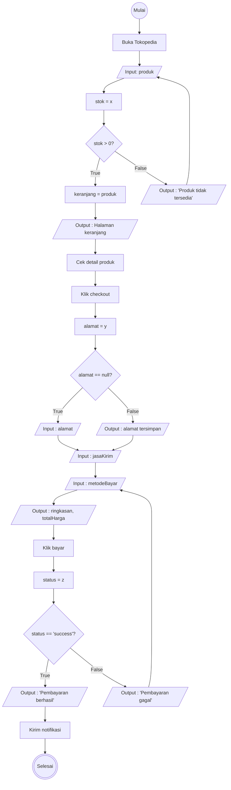

# Algoritma

## Analisa Proses Checkout Tokopedia

## Deskriptif

1. Mulai
2. Pengguna buka aplikasi Tokopedia
3. Pengguna memilh produk yang mau dibeli
4. Sistem mengecek stok produk, apakah ada atau habis
5. Jika stok habis, maka tampilkan "Produk tidak tersedia" kembali ke langkah 3
6. Jika stok ada, pengguna memasukkan produk ke keranjang atau langsung beli
7. Muncul halaman keranjang belanja
8. Pengguna mengecek jumlah barang dan detailnya
9. Pengguna meng klik tombol checkout
10. Sistem mengecek apakah ada alamat pengiriman?
11. jika tidak ada alamat, pengguna mengisi alamat pengiriman
12. Jika ada, sistem menampilkan alamat yang udah kesimpan
13. Pengguna memilih jasa pengiriman
14. Pengguna memilih cara pembayaran transfer, COD, atau yang lain
15. Menampilkan ringkasan pesanan dan total harga yang harus dibayar
16. Pengguna menekan tombol bayar
17. Sistem memproses pembayaran
18. Jika pembayaran gagal, maka menampilkan "Pembayaran gagal" kembali ke langkah 14
19. Jika pembayaran berhasil, maka menampilkan "Pembayaran berhasil"
20. Sistem mengirimkan notifikasi konfirmasi pesanan ke pengguna
21. Selesai

## Flowchart

