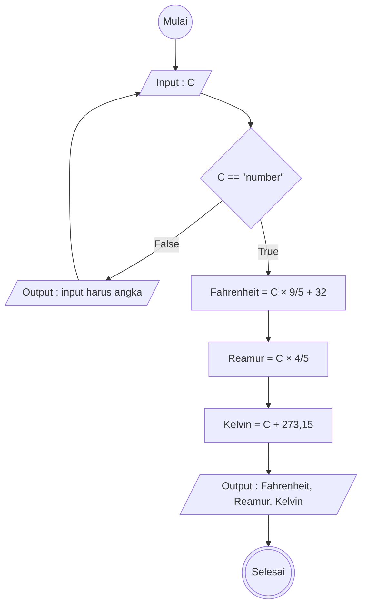

# Algoritma Progam Konversi Suhu

Memiliki 1 input dalam bentuk celcius
melakukan konversi dari nilai input ke fahrenhet, reamur dan nilai input

## Deskriptif

1. Mulai
2. Masukkan angka suhu Celcius ke dalam C
3. apakah C adalah suhu angka?
4. jika tidak, menampilkan "Input harus angka"
5. Menghitung rumus Celcius ke Fahrenheit adalah C dikali 9 dibagi 5 ditambah 32
6. Menghitung rumus Celcius ke Reamur adalah C dikali 4 dibagi 5
7. Menghitung rumus Celcius ke Kelvin adalah C ditambah 273,15
8. Menampilkan hasil dari : Fahrenheit, Reamur, Kelvin
9. Selesai

## Flowchart

