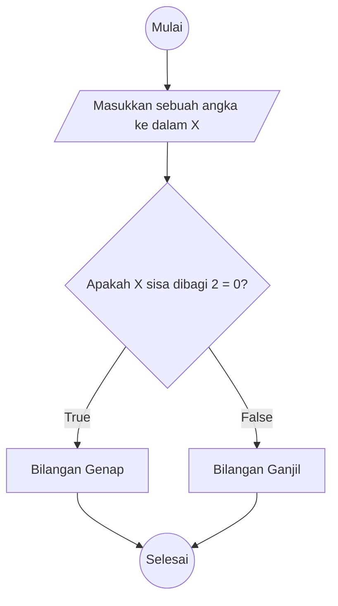

```mermaid

flowchart TD
    A@{ shape: circle, label: "Mulai" }
    B@{ shape: lean-r, label: "Masukkan sebuah angka ke dalam X" }
    C@{ shape: diamond, label: "Apakah X sisa dibagi 2 = 0?" }
    D@{ shape: rect, label: "Bilangan Genap" }
    E@{ shape: rect, label: "Bilangan Ganjil" }
    F@{ shape: circle, label: "Selesai" }

    A --> B
    B --> C
    C -- True --> D
    C -- False --> E
    D --> F
    E --> F


```
