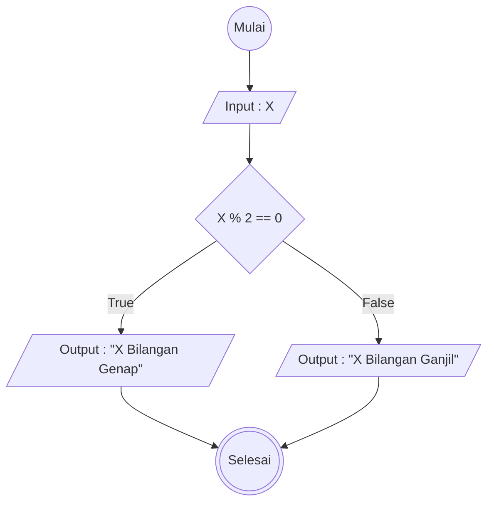

```mermaid

flowchart TD
    A@{ shape: circle, label: "Mulai" }
    B@{ shape: lean-r, label: "Input : X" }
    C@{ shape: diamond, label: "X % 2 == 0" }
    D@{ shape: lean-r, label: 'Output : "X Bilangan Genap"' }
    E@{ shape: lean-r, label: 'Output : "X Bilangan Ganjil"' }
    F@{ shape: dbl-circ, label: "Selesai" }

    A --> B
    B --> C
    C -- True --> D
    C -- False --> E
    D --> F
    E --> F


```
