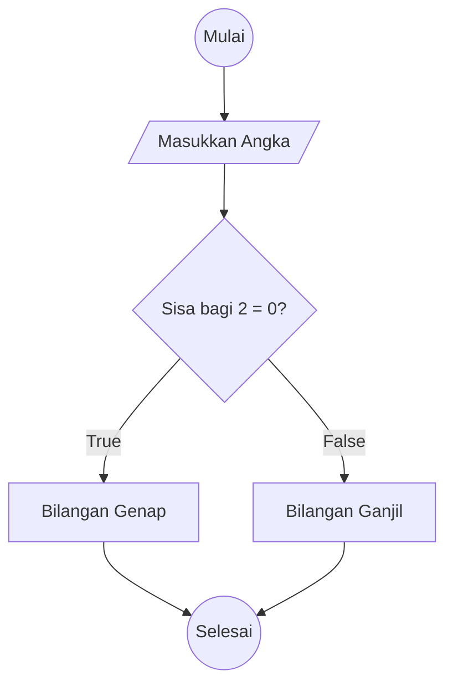

```mermaid

flowchart TD
A@{ shape: circle, label: "Mulai" }
B@{ shape: lean-r, label: "Masukkan Angka" }
C@{ shape: diamond, label: "Sisa bagi 2 = 0?" }
D@{ shape: rect, label: "Bilangan Genap" }
E@{ shape: rect, label: "Bilangan Ganjil" }
F@{ shape: circle, label: "Selesai" }

    A --> B
    B --> C
    C -- True --> D
    C -- False --> E
    D --> F
    E --> F


```
