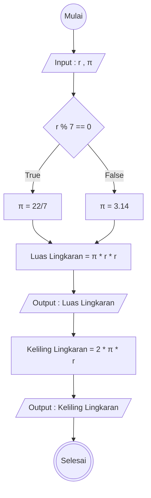

```mermaid
flowchart TD
    A@{ shape: circle, label: "Mulai" }
    B@{ shape: lean-r, label: "Input : r , π" }
    C@{ shape: diamond, label: "r % 7 == 0" }
    D@{ shape: rect, label: "π = 22/7" }
    E@{ shape: rect, label: "π = 3.14" }
    F@{ shape: rect, label: "Luas Lingkaran = π * r * r" }
    G@{ shape: lean-r, label: "Output : Luas Lingkaran" }
    H@{ shape: rect, label: "Keliling Lingkaran = 2 * π * r" }
    I@{ shape: lean-r, label: "Output : Keliling Lingkaran" }
     J@{ shape: dbl-circ, label: "Selesai" }


    A --> B
    B --> C
    C -- True --> D
    C -- False --> E
    D --> F
    E --> F
    F --> G
    G --> H
    H --> I
    I --> J

```
